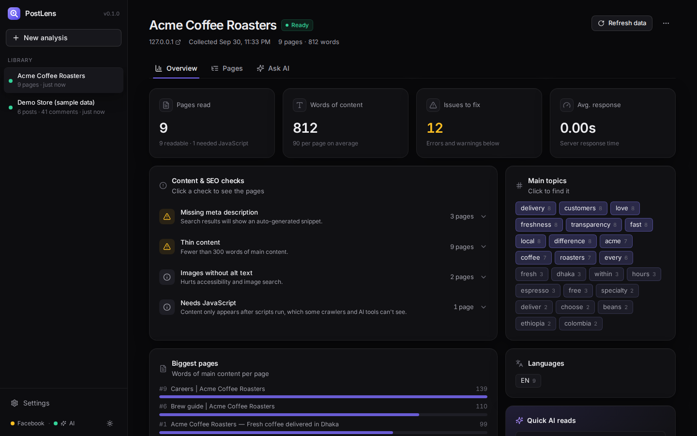
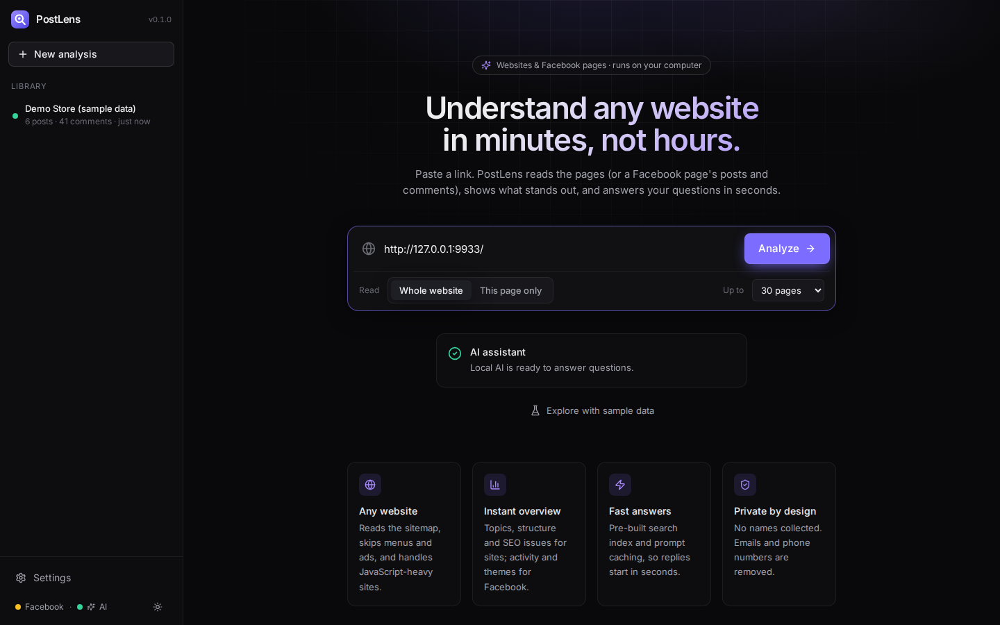
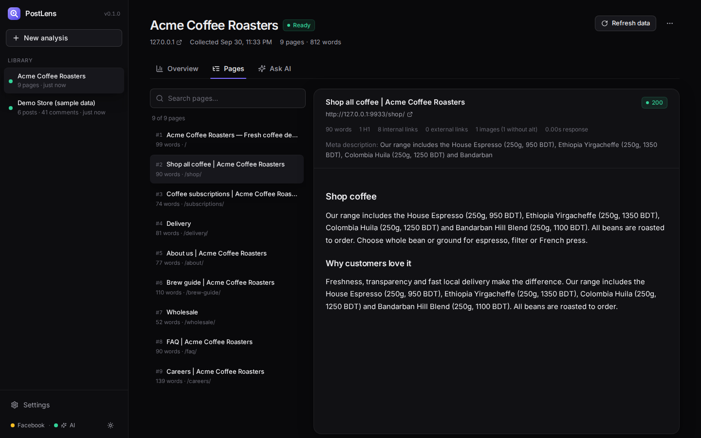
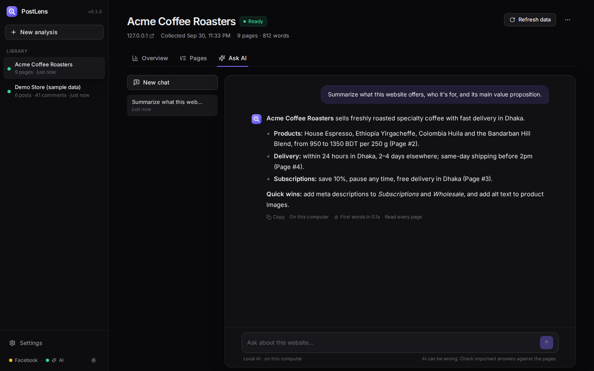
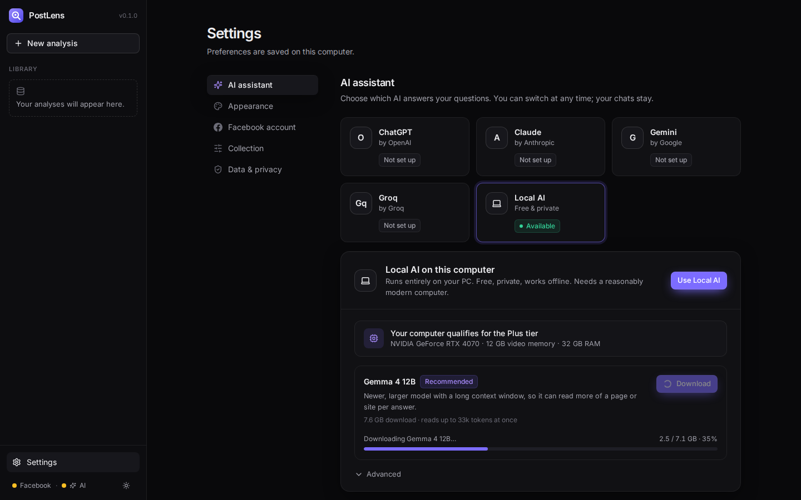
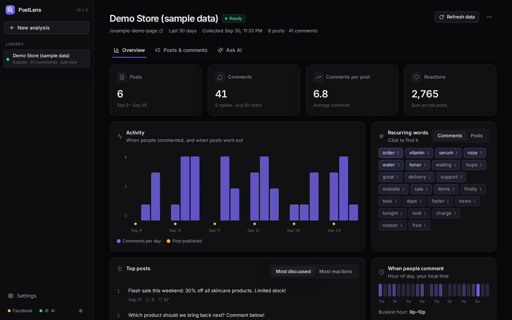
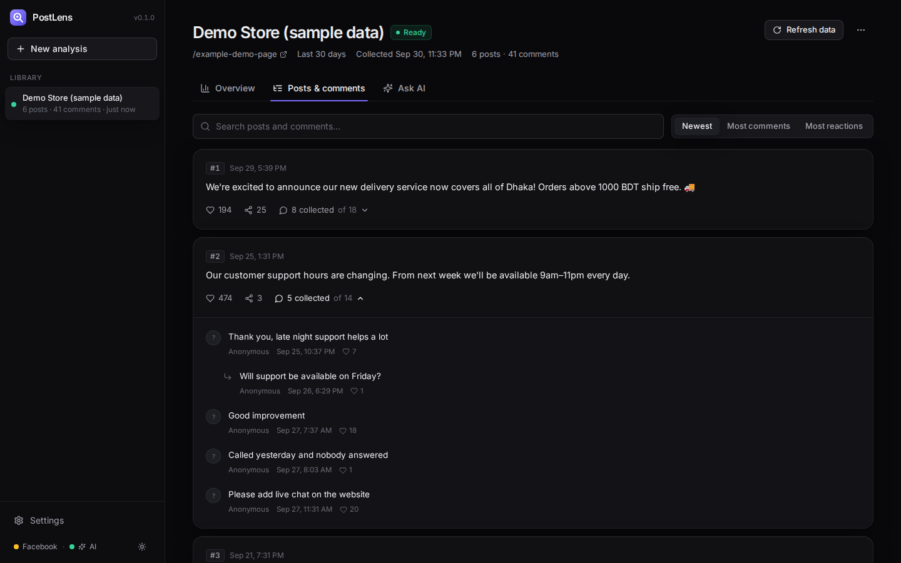
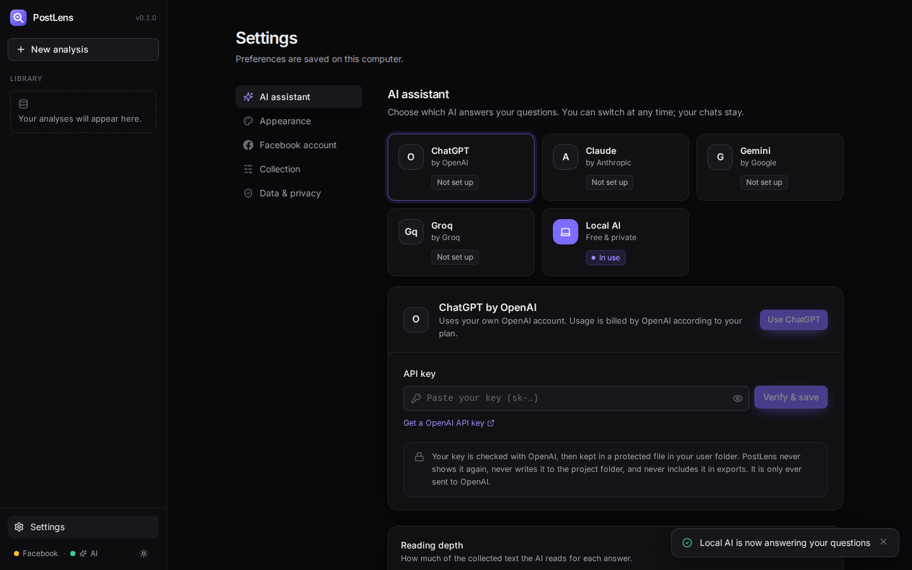
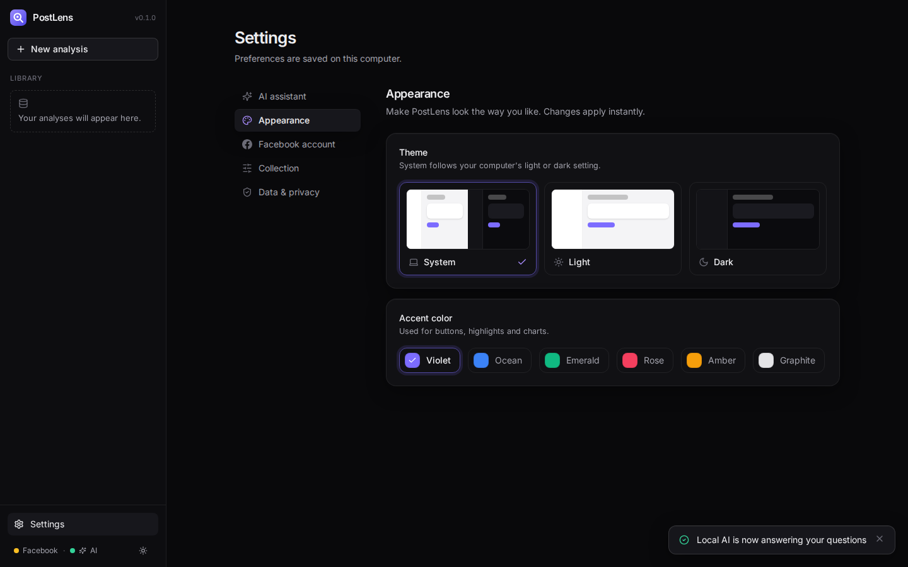

<div align="center">


# PostLens

**Understand any website or Facebook page in minutes.**
Paste a link. PostLens reads the pages (or a Facebook page's posts and comments), shows what stands out, and answers your questions in seconds, running on your own computer.

[](https://github.com/imohidul/PostLens/releases/latest)
[](https://github.com/imohidul/PostLens/actions/workflows/ci.yml)


### [⬇ Download for Windows](https://github.com/imohidul/PostLens/releases/latest) &nbsp;·&nbsp; [⬇ Download for Mac](https://github.com/imohidul/PostLens/releases/latest)



</div>

---

## Contents

- [Features](#features)
- [System requirements](#system-requirements) (read before installing)
- [Install](#install)
- [Set up the AI](#set-up-the-ai)
- [Local AI: tiers, models and memory](#local-ai-tiers-models-and-memory)
- [Fast answers: how PostLens does it](#fast-answers-how-postlens-does-it)
- [Use it](#use-it)
- [How collection works](#how-collection-works)
- [Privacy & API key safety](#privacy--api-key-safety)
- [Troubleshooting](#troubleshooting)
- [Development](#development)

---

## Features

**Websites**
- **Any website, one page or the whole site.** Discovers pages through the site's sitemap, then its links. It follows `robots.txt`, removes menus, footers and ads, and handles JavaScript-heavy sites.
- **Instant site overview.** Topics, the biggest pages, languages, response times, plus content & SEO checks: broken pages, missing or duplicate titles, missing meta descriptions, H1 problems, thin content, images without alt text, and pages that need JavaScript.
- **Read every page cleanly.** The main content is shown as formatted text next to page facts (links, images, headings).

**Facebook pages**
- Recent posts from a page, profile or group (7 days to 6 months) or a single post, with comments.
- **Anonymous by design.** Author names, profile links, photos and IDs are never collected. Tags, `@mentions`, emails and phone numbers are removed.
- Activity over time, busiest hours, recurring words, and the most discussed posts.

**Ask AI**
- Plain-language questions, streamed answers, citations like "Page #3" or "Post #4".
- **Fast.** A pre-built search index, prompt caching and a warm-up step mean answers start in seconds, and repeated questions are instant. See [how](#fast-answers-how-postlens-does-it).
- **Your choice of AI.** **ChatGPT, Claude, Gemini or Groq** with your own API key, or **Local AI** on supported computers.

**Product**
- System / light / dark themes and six accent colors.
- CSV (Excel-friendly, keeps Bangla and emoji) and JSON export.
- API keys stored in your operating system's secure credential store, never in files.

<table>
<tr>
<td></td>
<td></td>
</tr>
<tr>
<td></td>
<td></td>
</tr>
<tr>
<td></td>
<td></td>
</tr>
<tr>
<td></td>
<td></td>
</tr>
</table>
<sub>Screenshots use a local test website, the built-in sample data and a simulated AI. Answers shown are illustrative.</sub>

---

## System requirements

### To install and run PostLens (with a cloud AI: ChatGPT, Claude, Gemini or Groq)

| | Minimum |
|---|---|
| Operating system | Windows 10/11 (64-bit), macOS 12 or newer, or a modern 64-bit Linux |
| Python | Not needed for the installers (3.10+ only when running from source) |
| Memory (RAM) | 8 GB |
| Free disk space | 3 GB (app, browser engine ~150 MB, search model ~220 MB, your data) |
| Internet | Needed for collecting and for cloud AI |
| AI | An API key from OpenAI, Anthropic, Google or Groq |

### To use Local AI (optional, free and private)

PostLens is a premium tool, so it doesn't offer small "toy" models or slow CPU-only generation. **Local AI appears in Settings only if your computer meets these minimums.** Otherwise the option is hidden and Settings explains why.

| | Minimum | Recommended |
|---|---|---|
| Windows / Linux | NVIDIA or AMD graphics card with **8 GB video memory (VRAM)** and **16 GB RAM** | 12 GB+ VRAM, 32 GB RAM |
| Mac | Apple Silicon (M1 or newer) with **16 GB** memory | 24 GB+ memory |
| Free disk space | **20 GB** | 40 GB |
| Software | The free [Ollama](https://ollama.com/download) app | |

Not supported for Local AI: computers without a dedicated NVIDIA/AMD graphics card, Intel integrated or Intel Arc graphics, and Intel-based Macs. These computers can still use every other feature with a cloud AI.

PostLens detects your graphics card, video memory, RAM and disk space itself (Settings → AI assistant → Local AI shows what it found).

---

## Install

### Windows 10 / 11

1. Download **`postlens.exe`** from the [latest release](https://github.com/imohidul/PostLens/releases/latest).
2. Double-click it and follow the steps. No administrator rights needed. You can add a desktop shortcut.
3. Open **PostLens** from the Start menu.

> **"Windows protected your PC"?** The app isn't code-signed yet (signing certificates are a paid service), so Windows SmartScreen shows this for new apps. Click **More info → Run anyway**.

### Mac (Apple Silicon: M1 or newer)

1. Download **`postlens.dmg`** from the [latest release](https://github.com/imohidul/PostLens/releases/latest).
2. Open it and drag **PostLens** into **Applications**.
3. Open PostLens. The first time, macOS says it can't verify the developer, because the app isn't notarized by Apple yet. Go to **System Settings → Privacy & Security**, scroll down, and click **Open Anyway**. You only need to do this once.

Intel Macs can [run from source](#run-from-source).

### First launch

- PostLens opens in its own window. Everything it stores lives in a `.postlens` folder in your user folder, so uninstalling or updating never deletes your analyses.
- The first time you analyze a JavaScript-heavy site or connect Facebook, PostLens downloads its browser engine once (about 150 MB).
- The first analysis downloads the multilingual search model once (about 220 MB).

### Updating

Download the new version from [Releases](https://github.com/imohidul/PostLens/releases) and install it over the old one. Your data and API keys are kept.

### Run from source

For developers, or on Intel Macs and Linux. Needs **Python 3.10+**.

```bash
git clone https://github.com/imohidul/PostLens.git
cd PostLens
./install.sh        # Windows: double-click install.bat
./run.sh            # Windows: double-click run.bat
```

---

## Set up the AI

Open **Settings → AI assistant** and pick one:

| Option | What you need | Notes |
|---|---|---|
| **ChatGPT** (OpenAI) | API key from [platform.openai.com/api-keys](https://platform.openai.com/api-keys) | Paid per use by OpenAI |
| **Claude** (Anthropic) | API key from [console.anthropic.com](https://console.anthropic.com/settings/keys) | Paid per use by Anthropic |
| **Gemini** (Google) | API key from [aistudio.google.com](https://aistudio.google.com/app/apikey) | Free tier may be available (limits apply) |
| **Groq** | API key from [console.groq.com/keys](https://console.groq.com/keys) | Free tier may be available (limits apply) |
| **Local AI** | A supported computer (see above) + [Ollama](https://ollama.com/download) | Free, private, works offline |

Paste the key and click **Verify & save**. PostLens checks the key with the provider before storing it. Then click **Use …**.

> With a cloud provider, the anonymized text needed for each question is sent to that provider. With Local AI, nothing leaves your computer. Provider pricing and free tiers change, so check their sites.

---

## Local AI: tiers, models and memory

When your computer qualifies, PostLens recommends the best free model it can run well and downloads it for you with one click (**Settings → AI assistant → Local AI → Download**).

| Tier | Your hardware | Recommended model | Download |
|---|---|---|---|
| Standard | 8 GB+ VRAM & 16 GB RAM, or Apple Silicon 16 GB+ | Qwen 3.5 9B (`qwen3.5:9b`) | 6.6 GB |
| Plus | 12 GB+ VRAM & 16 GB RAM, or Apple Silicon 24 GB+ | Gemma 4 12B (`gemma4:12b`) | 7.6 GB |
| Pro | 24 GB+ VRAM & 32 GB RAM, or Apple Silicon 36 GB+ | Qwen 3.8 27B (`qwen3.8:27b`) | 18 GB |

Download sizes are from the [Ollama model library](https://ollama.com/library) as of September 2026. Only models from this list can be used, and only up to your tier. Other models you may have installed in Ollama are ignored, so answers stay premium-quality.

### How much memory Local AI uses (and why)

PostLens deliberately uses extra memory where it buys speed:

| What | Memory | Why |
|---|---|---|
| The model | About its download size, in video memory (or unified memory on a Mac) | The model must sit in fast memory to generate quickly |
| Reading window (context) | Roughly 1–4 GB extra, depending on model and tier | Fixed at 16k tokens (Standard) or 32k (Plus/Pro), so the model can read more of a site at once. It stays fixed because changing it forces a slow model reload |
| Kept loaded for 30 minutes | Memory stays in use between questions | Avoids reloading the model before every answer (a reload can take several seconds) |
| Search model | ~300 MB RAM | Finds the most relevant passages for each question |

To close Local AI's memory use immediately, quit the Ollama app.

### Optional: make Local AI faster and lighter

These are Ollama settings, documented in the [Ollama FAQ](https://docs.ollama.com/faq). On Windows, open **Settings → search "environment variables" → Edit environment variables for your account**, add them, then restart Ollama:

| Variable | Value | Effect |
|---|---|---|
| `OLLAMA_FLASH_ATTENTION` | `1` | Turns on Flash Attention, which can significantly reduce memory use |
| `OLLAMA_KV_CACHE_TYPE` | `q8_0` | Stores the reading window at about half the memory of the default |

### Updating the recommended models

Recommendations live in one file: [`postlens/data/models.json`](postlens/data/models.json). PostLens checks the copy in your GitHub repository once a day. When a better free model is released:

1. Edit `models.json` on GitHub (change `model`, `name`, `download_gb`, and raise `version`, e.g. `2026.12.01`).
2. Every install sees the new recommendation within a day (or right away via **Local AI → Advanced → Check for updates**) and shows **"A better model for your computer is available"** with a Download button.


---

## Fast answers: how PostLens does it

Chat users expect replies to start almost immediately. PostLens combines established production techniques:

| Technique | What it does |
|---|---|
| **Streaming** | Words appear as they're written instead of after the whole answer |
| **Pre-built hybrid search index** | Right after collection, content is split into passages and indexed. Search combines keyword ranking (BM25: exact names, prices, codes) with multilingual semantic embeddings (meaning and paraphrases, including Bangla), merged with Reciprocal Rank Fusion. Asking a question costs one tiny embedding plus a lookup |
| **Cache-friendly prompt layout** | The large, unchanging part (instructions + site/page overview, or all the data when it fits) is identical for every question and comes first. Only the question-specific passages come last |
| **Provider prompt caching** | Claude: the data block is marked for caching. OpenAI & Gemini: identical prefixes are cached automatically. Follow-up questions skip re-reading the data |
| **Local AI warm-up** | Opening **Ask AI** loads the model and pre-reads the dataset before you finish typing, so the first question starts fast |
| **Local AI tuned for speed** | Model kept in memory (no reloads), fixed reading window, and "thinking mode" switched off for chat, so reasoning models don't pause silently before answering |
| **Instant repeat answers** | The same opening question about the same data with the same model returns the saved answer instantly (a **Regenerate** button asks again) |

Every answer shows how long it took for the first words to appear (e.g. *"First words in 0.9s"*), so you can compare providers on your own machine.

---

## Use it

**A website**
1. Paste a link such as `https://example.com` and choose **Whole website** (up to 10–200 pages) or **This page only**.
2. Watch it read. Stop at any time and keep what was collected.
3. **Overview** shows stats and checks, **Pages** lets you read each page, and **Ask AI** answers your questions.

**A Facebook page**
1. **Connect Facebook** once. A browser window opens on Facebook's own login page, and PostLens never sees your password.
2. Paste the page or post link, choose the time range, and click **Analyze**.

No link handy? Click **Explore with sample data** on the home screen.

---

## How collection works

**Websites**
1. Reads `robots.txt` and obeys it, including crawl-delay. Pages a site asks bots not to read are skipped.
2. Finds pages from the XML sitemap first, then by following links on the same site. Tracking parameters and duplicate URLs are removed.
3. Fetches pages with a fast HTTP client. Only pages that turn out to be JavaScript app shells are opened in a real headless browser.
4. Extracts the main content with [Trafilatura](https://trafilatura.readthedocs.io/), a widely used open-source extractor that ranks among the best in independent main-text extraction benchmarks. The result is saved as Markdown, keeping headings, lists and tables.
5. Removes emails and phone numbers from the text. Reader comments are not collected.

**Facebook.** A real browser, signed in as you, scrolls the page. PostLens reads the post and comment data the Facebook web app downloads (full text and exact dates), never author or profile fields. When Facebook changes its layout, fixes go in [`postlens/scraper/selectors.py`](postlens/scraper/selectors.py) and [`graphql_parser.py`](postlens/scraper/graphql_parser.py).

### ⚠️ Responsible use
- Only analyze content you're allowed to. Respect websites' terms.
- **Facebook's terms** don't allow automated collection without permission, and heavy use can restrict an account. Use a secondary account and small date ranges. **You are responsible for how you use this tool.**
- AI can be wrong. Check important answers against the pages or posts.

---

## Privacy & API key safety

- Everything is stored locally in `~/.postlens/` (Windows: `C:\Users\YOU\.postlens`), never in the project folder.
- The app only listens on `127.0.0.1`, so other devices can't reach it.
- **API keys** are stored in the operating system's credential vault (Windows Credential Manager, macOS Keychain) via [`keyring`](https://pypi.org/project/keyring/). They never go into `settings.json`, the database, exports, logs or the project folder, and the app never sends them back to the page (only the last 4 characters). Error messages are scrubbed of key fragments. If no vault exists (e.g. a headless Linux server), keys fall back to `~/.postlens/secrets.json` with owner-only permissions.
- **Before every `git push`**, run `python -m pytest`. `tests/test_security.py` fails if anything that looks like an OpenAI, Anthropic, Google or Groq key is in the repository.
- **Settings → Data & privacy → Delete all** wipes collected data. **Disconnect** removes the Facebook session.

---

## Troubleshooting

| Problem | Fix |
|---|---|
| Website: "robots.txt asks automated tools not to read this page" | The site owner has opted out, so PostLens respects that. |
| Website: few or empty pages | The site may block automated access or need a login. Set **Settings → Collection → JavaScript sites** to *Always*. |
| Local AI doesn't appear in Settings | Your computer is below the [minimum](#to-use-local-ai-optional-free-and-private). Settings → AI assistant shows the exact reason. |
| "Local AI isn't running" | Open the Ollama app, then click **Check again**. |
| First local answer is slow | The model is loading into memory (only the first time, or after 30 minutes idle). |
| "…rejected the API key" | Copy the key again from the provider and use **Replace**. |
| "rate limit or quota reached" | Wait a minute, check your plan, or choose **Focused** reading depth. |
| "No posts found" (Facebook) | The page may be private or have no posts in the range, or Facebook changed its layout. Try a single post link. |
| Few comments (Facebook) | Set your Facebook language to **English** while collecting. |
| "Couldn't download the browser engine" | Check your internet connection and try again. The download goes to `.postlens/browsers` in your user folder. When running from source, you can also run `python -m playwright install chromium`. |
| The app window stays blank | Windows: install the free [Microsoft Edge WebView2 Runtime](https://developer.microsoft.com/microsoft-edge/webview2/). PostLens otherwise opens in your browser instead. |

Crash details are saved in `~/.postlens/logs/`. Please attach them when opening an issue.

---

## Development

```bash
# backend (auto-reload)
.venv/bin/python -m pip install pytest
.venv/bin/python -m uvicorn postlens.server:app --reload --port 8765

# frontend (hot reload on http://localhost:5173, proxies /api to 8765)
cd frontend && npm install && npm run dev

# build the UI into postlens/static (commit it so users don't need Node)
npm run build

# tests (run before every push)
.venv/bin/python -m pytest -q

# build the desktop app locally (output in dist/)
.venv/bin/python -m pip install pyinstaller
.venv/bin/pyinstaller packaging/postlens.spec --noconfirm
```

### Publishing a release

1. Update the version in `postlens/__init__.py`, `pyproject.toml` and `frontend/package.json`, and add notes to `CHANGELOG.md`.
2. Commit, then tag and push:
   ```bash
   git tag v1.0.1
   git push origin v1.0.1
   ```
3. GitHub Actions ([`release.yml`](.github/workflows/release.yml)) builds the Windows installer and the Mac disk image, checks that each one starts, and attaches them to a new release on the [Releases](https://github.com/imohidul/PostLens/releases) page. This takes about 15–20 minutes.

API docs: `http://127.0.0.1:8765/api/docs` while the app runs.

```
postlens/
  server.py            HTTP API + serves the UI
  jobs.py              background collection runs + indexing
  db.py                SQLite: datasets, pages, posts, comments, search index, chats, answer cache
  hardware.py          detects GPU / VRAM / RAM / disk for the Local AI gate
  runtime.py           desktop-app specifics (browser engine download, logs)
  keystore.py          API keys in the OS credential vault
  web/
    crawler.py         robots.txt, sitemaps, link discovery, JS rendering fallback
    extract.py         main-content extraction (Trafilatura) + page facts
    analysis.py        site overview and content/SEO checks
  scraper/             Facebook collection (browser, JSON parser, selectors)
  ai/
    index.py           chunking, multilingual embeddings, hybrid search (BM25 + RRF)
    assistant.py       cache-friendly prompts, answer cache, warm-up
    providers.py       OpenAI, Anthropic, Gemini, Groq and Local AI clients
    local.py           model catalog, downloads, hardware tiers
  data/models.json     recommended local models per tier (update on GitHub)
  static/              built web UI
frontend/              React + TypeScript + Tailwind source
packaging/             desktop app build: PyInstaller spec, Windows installer, Mac disk image, icons
.github/workflows/     CI tests + automatic release builds
tests/
```

## License

[MIT](LICENSE). Not affiliated with Meta, OpenAI, Anthropic, Google, Groq or Ollama. Product names are trademarks of their owners.
